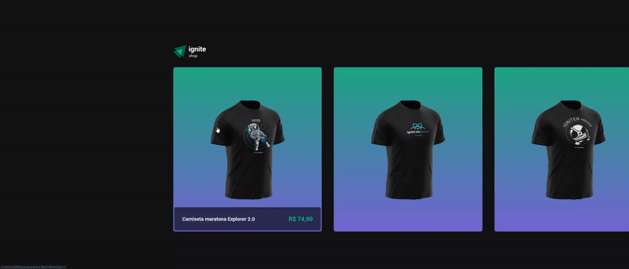

<h1 align="center">
  Ignite Shop
</h1>

<p align="center">
 O Ignite Shop é um e-commerce web feito sob medida para desenvolvedores. Aqui, você encontra uma coleção de camisetas para devs.

<p align="center">
  <a href="#como-executar">ℹ️ Como Executar?</a>&nbsp;&nbsp;&nbsp;|&nbsp;&nbsp;&nbsp;
  <a href="#web">💻 Web</a>&nbsp;&nbsp;&nbsp;|&nbsp;&nbsp;&nbsp;
  <a href="#tecnologias">🚀 Tecnologias</a>&nbsp;&nbsp;&nbsp;
</p>

---

# Como Executar?

> Clone o Repositório:

Node version 20.10.0

Clone

```bash
git clone https://github.com/JonatanPaes/ignite-shop.git
```

Para executar o projeto

```bash
cd ignite-shop
```

Instale as dependências do projeto

```bash
npm i

# Copiar o arquivo com os dados de conexão e demais variáveis ambiente
cp .env.local.exemple .env.local
```


# Web
Para executar o projeto

```sh
npm run dev
```

<p align="center">
  
</p>

# Tecnologias
- [NextJS](https://nextjs.org/)
- [TypeScript](https://github.com/microsoft/TypeScript)
- [Stitches](https://stitches.dev/)
- [Keen-Slider](https://keen-slider.io/)
- [Stripe](https://github.com/stripe/stripe-node)
- [Axios](https://axios-http.com/)